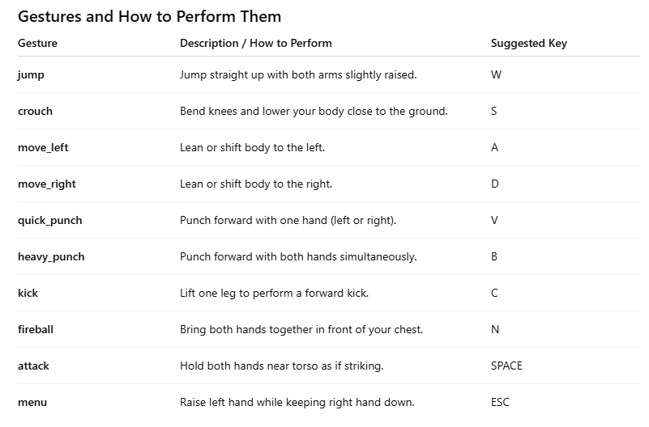

# Body-Game-Gesture-Detection

### Karate Fighter Gesture Dataset

(Check code in Data/DataCollection-10gestures.ipynb)

This dataset contains pose keypoints collected via MediaPipe for training gesture recognition in the Karate Fighter game. Each gesture is saved as a short clip of 30 frames (~1 second), stored in the karate_data/<gesture_name>/ folder.

### Data Collection Details

- Each gesture has 3 clips for training (CLIPS_PER_GESTURE = 3).
- Each clip contains 30 frames (FRAMES_PER_CLIP = 30).
- Frames store 33 3D keypoints (x, y, z) using MediaPipe Pose.

### Usage

- Run the data collection script to record gestures from a webcam.
- Keypoints are saved as .npy files in karate_data/<gesture>/.
- Use this dataset for training gesture recognition models (e.g., Decision Tree, Random Forest, or LSTM).
- For live detection, load the trained model and feed sequences of keypoints from the webcam.
